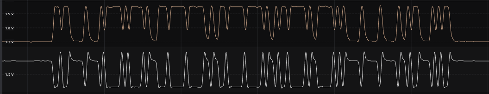
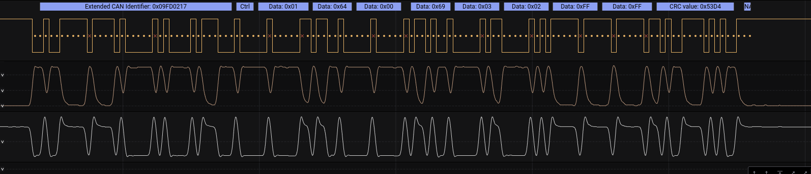
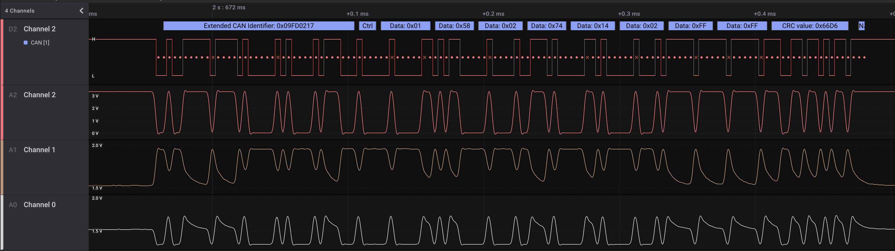

# CAN Overview

Controller Area Network has been around since the 1980s and was originally developed by Bosch for automotive applications. Almost every car on the road today utilizes some type of CAN network to assist in controlling various different in the car. From headlights to door locks, the ability to control multiple devices with a single pair of wires has an obvious cost saving benefit. CAN is not fast when compared with TCP/IP (Max of 1Mbps), but it is robust and reliable and designed for real time applications.

The CAN protocol is defined in ISO 11783 and has been extended for various applications, ranging from heavy equipment to factory automation. OpenBridge specifically targets the maritime application with NMEA 2000. The National Marine Electronics Association (NMEA) developed the application layer that sits on top of the [ISO 11783](https://www.iso.org/standard/57556.html) standard. It has defined various Parameter Group Numbers (PGN) that define what data is passed for particular devices. NMEA keeps the official documentation to the standard closed but much of the library has been reverse engineered and can be found in the [CANboat Project](https://github.com/canboat/canboat). Of specific interest is the [.json object](https://github.com/canboat/canboat/blob/master/analyzer/pgns.json) with all PGNs identified to date.

Many tools like CanBoat can decode the PGNs for you but with the goal of learning about CAN and how it can help us monitor and learn about maritime electronics, let's jump into a quick overview of CAN and how to decode PGNs. For more on this, please see the [links](links.md) page for more great resources.

On CAN and NMEA 2000 there is no central controller each node on the network is its own ECU and is responsible to receiving and transmitting in accordance with the standard.

## The Wires

Generally NMEA 2000 and CAN are comprised of two wires, a CAN High (hi) and CAN Low (lo).

As you can see there are two terms here. **Dominant** Voltage, where the signal is moving away from the steady state voltage (in this case 2.5V) and **Recessive** Voltage where the voltage of the High and Low are the same. If no signal is given to the bus it will maintain the recessive state. The recessive state is translated into a binary signal of **1** while the dominant is read as a **0**. This becomes important later when considering arbitration and bit stuffing but for now look at the CAN lo signal and see how it compares with the Driver Logic and know this is what happens on the wire electrically.

Importantly the speed of NMEA 2000 is 250Kbps but the standard allows for high speeds for shorter distances and slower speeds for longer distances.

If you captured the voltages on the CAN hi and CAN Lo of a NMEA 2000 and zoomed into a single frame (A frame being the term for one of four types of can messages) you would get something looking like this:

In this case you can see a little more sloppy version of the neat tidy CAN Signal. Both plots are centered around 1.7V but it is not entirely obvious due to scale. You can see that the CAN Lo (the lower line) is getting pulled down while the CAN Hi is getting pulled up. It is difficult to determine but the first three bits of this frame are 001 where the start of frame is identified by the first **Dominant** bit. (If we keep saying it eventually it will make sense!)

We already stated that each node is its own ECU meaning it is responsible for independent operation. To know when to start to listen is important in this case we look a the first Dominant bit as a good place to start. The CAN chips are hard coded in silicone to look for that **Start of Frame** bit (SoF) and begin to listen.

This plot is all fine and good but in reality we need more to determine what we are actually looking at. For this we need to use a tool known as a Logic Analyzer, specifically one that can decode CAN protocol identifiers. The tool I am using is an expensive one, a [Saleae Logic Pro 16](https://www.saleae.com/). They make beautiful software and wonderful hardware, the Logic 8 is much more reasonable and has [student, hacker pricing](https://blog.saleae.com/saleae-discounts/). There are other logic analyzers with different capabilities like the [Analog Discovery 2](https://store.digilentinc.com/analog-discovery-2-100msps-usb-oscilloscope-logic-analyzer-and-variable-power-supply/) which also can be a scope and signal generator but the software is a bit more dated and not as immediately intuitive for hobbyists.

## Logical

As you can see in the capture below the capture is much easier to read after it is processed by the logic analyzer. Some logic analyzers will deal with the floating base voltages (in our case 1.7V). To avoid this OpenBridge has integrated a low cost CAN Transceiver that essentially provides a clean logic signal between 0-3.3V. That signal can then be easily read and decoded by any logic analyzer.

Suddenly we can easily see how great a logic analyzer is. It provides the different parts of the frame broken up on the top of the cleaned up logic, it removes a lot of the variability in the voltage signal and provides an easy way to visually count bits. You will also notice that it provides a visual "x" for stuffed bits (the 6th bit after 5 consecutive bits of "1" or "0").

Important to note here: Saleae CAN analyzer gives us a Hex value for our frame Identifier right away and identifies that is an extended Identifier! So great.

## Transceiver

If you noticed the [Bill of Materials](bom.md) for OpenBridge you will notice that that the Teensy needs a Transceiver to enable communication. You can also note that the [pinout for the Teensy](https://www.pjrc.com/teensy/card11a_rev3_web.png) does not indicate Can Hi or Can Lo but **CanTX** and **CanRX** (Pin 23 and 22)

For that reason the Teensy micro-controller has one pin to listen (CRX) and one pin to speak on the bus (CTX). If you look at the pinout you will notice that the Teensy has not one CAN interface but **Three** CAN Interfaces. The first version of the OpenBridge board will only take advantage of CTX1/CRX1 and CTX2/CRX2 and have two transceivers.

The transceiver is the part that sorts this out and provides the logic adjustment between can bus and voltage (as displayed above) centered around 2.5 and 1.4 volts (for CAN Lo) and a simple 0 to 3.3 volt signal. The Teensy can transmit onto the CAN bus with the CTX pin thought the transceiver.

The CRX1 output digital and analog are shown as Channel 2 (the first two lines) in the image above. Notice that the red analog line (the second line) is showing a much cleaner analog voltage signal between 0V and 3.3V. As you noticed in the [Logical](Logical) section the Saleae can decode CAN without a Transceiver so if you have a Saleae and you are looking to read your bus you can do so without any other hardware!

## The Identifier

CAN has a standard 11 bit and extended 29 bit identifier. We will use the frame above as an example when we learn to manually decode the identifier into a Priority Group Number (PGN) which will tell us what type of frame we are looking at. Together the entire Identifer is known as a Protocol Data Unit (PDU) and consists of 7 parts outlined below

### SOF

Before we get into exploring the PDU we need a place to start.

We mentioned that a node will be listening for a SoF bit, or when the state changes from recessive to dominant. After that our identifier begins. Identifiers can be considered as a whole or in parts, we will be breaking down the parts to put them back together into a PGN.

### Priority Bits

After the SoF the next three bits are the **Priority Bits**, which provide a way to allow more important traffic to get through on the bus first. As we start to think about this concept return to the idea of the Recessive and Dominant signals. Remember we said that a "1" was a Recessive state and the Dominant state was "0". From the above image we can see that the first bit is our SOF and the following are a 010 (or decimal 2). When we talk about how CAN nodes avoid overwriting each other this will make more sense. The frame starts to get a little more messy in the extended identifier. as we move pas the priority bits.

### Reserve Bit

The next bit is the Reserve Bit which in this case is reserved for future use. It is used in the PGN.

### Data Page Bit

Aftre the Reserve Bit is the Data Page bit. This is used in ISO 11783 but for our simple example is part of the PGN.

### PDU Field Format

The next 8 bits comprise the PDU Field Format (PF). This field is broken up by the Substitute Remote Request (SRR) and   Identifier Extension Bit (IDE). The controller will filter the SRR and IDE out of the Identifier and are not included in the PGN so again for the purpose of finding the PGN we need not consider the SRR or IDE. THe PDU Field Format when combined with the Reserve Bit (R) and Data Page (DP) Bit are really the core of the PGN. In the example we are using the R, DP and PF to get 10 bits:

| Bit | Value |
|-----|-------|
| R   | 0     |
| DP  | 1     |
| PF8 | 1     |
| PF7 | 1     |
| PF6 | 1     |
| PF5 | 1     |
| PF4 | 1     |
| PF3 | 1     |
| SSR | 1     |
| IDP | 1     |
| PF2 | 0     |
| PF1 | 1     |

You can notice that there is an "x" in one bit after 5 consecutive "1"s. That is an example of a stuffed bit and is to be disregarded, it will be ignored by the CAN controller. Additionally you will notice that we find the SRR and IDE bits in the mix, We can again disregard these when finding the PGN.

First lets look at the PF Field. We will find PF8 to PF1 values as follow `11111101`. We know that 2^8 is 255 and that make our number two below that, 253. This decimal value will come in hand later when we go to calculate our PGN. When we add in the `R` and `DP` bits we are left with the first 10 bits of the PGN.

Right now we know the first 10 bits of our PGN are:

`011111101`

### PDU Specific Group Extension Field

The next 8 bits are part of what is known as the PDU Specific field or `PS`. In the ISO standard this field has many uses but in NMEA 2000 the next 8 bits is known as the Group Extension. The ISO standard have various uses but in this case we can see that the Group Extension is `00000010` or a decimal 2.

### Source Address

The last 8 bits are the source address and will be the ID of the node, with only 8 bits that represents 256 different addresses that are possible on the network.

## Calculating PGN

Now that we can taken considerable time looking at each section of the Identification section of a CAN frame we can now decode what the actual PGN is.

To calcuate the PGN we first must look at the PDU Field Format Value. If that value is under 240 the PGN will be:

Reserve + Data Page + PDU Field + `00000000`

That is right the last section where the Groupd Extension would go becomes a byte of zeros.

If the PDU Field Format is greater than or equal to 240 the lower byte is set to the Group Extension.

Lets consider our example:

| Bit | Value |
|-----|-------|
| R   | 0     |
| DP  | 1     |
| PF  | 253   |
| GE  | 2     |

In this case we are left with a `PF` > 240 so

|R | DP | PF       | GE       |
|--|----|----------|----------|
| 0| 1  | 11111101 | 00000010 |

Put them together to get

`011111110100000010` Binary

`130306` Decimal

`0x1fd02` Hex

### PGNs the easy way

There is an easier way to do this however:

1) Use the little Python script called [PGN.py](../tools/PGN.py) like this: `python3 PGN.py 09FD0217`. Note: Recall that the argument after `PGN.py` is the Hex value of the extended identifier.
2) Utilize a handy [Google Sheet](https://www.csselectronics.com/screen/page/j1939-pgn-conversion-tool/language/en) by CSS Electronics. Simply copy to your Google Drive and enter an Identifer in and get the different parts of the Identifer and PGN.

### Find the rest of your frame

Once you have the PGN you can determine what the rest of the frame may be. NMEA 2000 may be a single frame message, a request or a multi-frame or FastPacket message. A good resource for this is the [CANboat json](https://github.com/canboat/canboat/blob/master/analyzer/pgns.json) object, simply search the object for your PGN and you can see what bytes are what in the data section of the frame!

## Arbitration

When we consider arbitration, which is the method CAN employs to avoid messages overwriting each other on the bus, it is going to have each transmitting node listen on the bus as it transmits.
